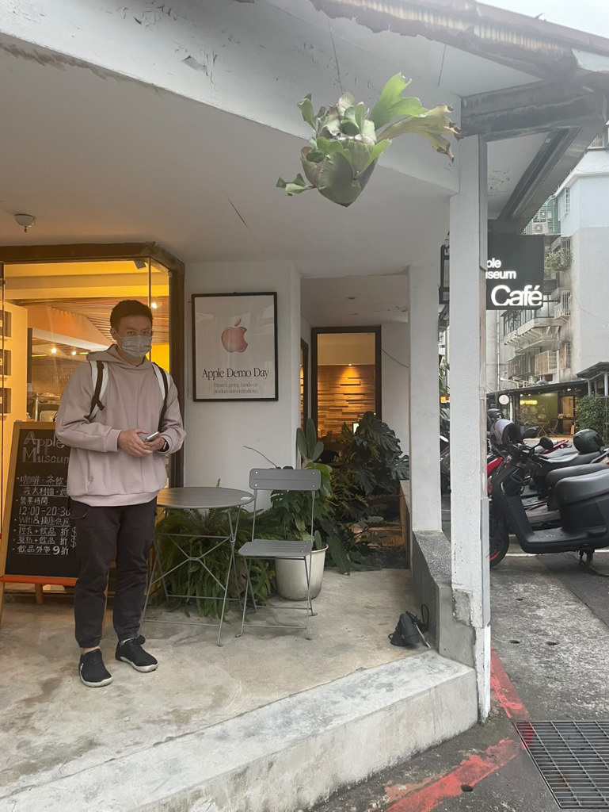

# About

I'm Wedge ([@webigis](https://x.com/webigis) on X). I build software with LLM agents. I also study languages and learning science. My current project is Tsumugu, a Traditional Mandarin encoding dictionary.

The site is a set of linked notes on learning systems, language study, and software work with LLM agents.

## What I write about

- **Learning systems**: encoding, retrieval, metacognition, and self-regulation.
- **Agentic engineering**: building software with LLM agents while keeping taste, verification, and ownership.
- **Attention and environment**: focus, social media, minimalism, recovery, and decision friction.
- **Money**: budgeting and investing mindsets from first principles, and where AI changes them.
- **中文**: Traditional Mandarin: how characters work, comprehensible input, and a reader that adds text as your vocabulary grows.
- **Language learning**: immersion, attention, comprehension, and practical workflows.

## How it's built

The vault is kept in [Obsidian](https://obsidian.md), published through [Astro](https://astro.build), and hosted from [logos52.github.io](https://github.com/logos52/logos52.github.io). The underlying pattern is described in [[wiki/Systems/AI & Agentic Systems/Context Engineering|LLM Knowledge Systems]]. The repo is described in [[README]]. The rules the agents follow are in [[AGENTS]].

The code is under the MIT license. The written content is released under [CC BY 4.0](https://creativecommons.org/licenses/by/4.0/).

## Elsewhere

- [GitHub](https://github.com/logos52): code and project repositories.
- [X: @webigis](https://x.com/webigis): shorter posts.
