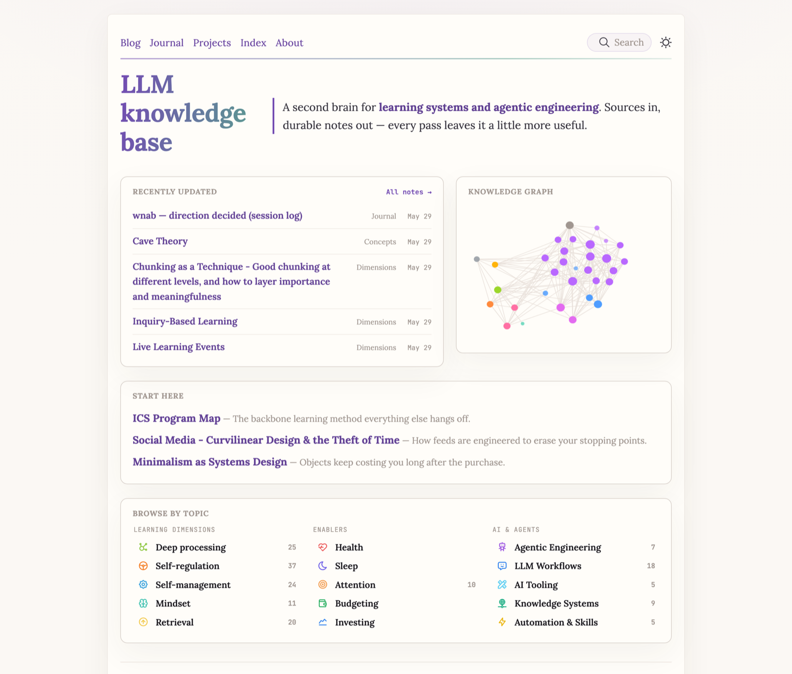

## What it is

This site. `llm-knowledge-base` is a public, LLM-maintained second brain: source material goes in, and durable, linked markdown notes come out — each pass leaving the base a little more useful. It is an Obsidian vault published to the web with [Quartz](https://quartz.jzhao.xyz/), and a running experiment in using LLM agents to *maintain* a knowledge base over time.

## How it's built

The vault lives in [Obsidian](https://obsidian.md); Quartz compiles it to a static site on GitHub Pages. The wiki is organized as a pipeline — raw sources are compiled into concept, technique, and synthesis pages, cross-linked so the graph stays navigable. LLM agents do much of the compilation, health-checking, and synthesis, working against an operating contract that keeps private material out of the public build.

## What worked

Treating the knowledge base as the *primary* surface — the place daily thinking actually happens — is what made it stick. Durable pages beat re-deriving the same answers, and a public-by-default stance forces clarity. Agent contracts plus publish guards let me work in the open without leaking private notes or finances.

## Lessons

- **Accumulation beats archiving.** The value lives in pages that get reused and revised, not in a pile of captured sources. The pipeline exists to turn raw input into something a future question can build on.
- **Keep the human in the loop.** The base amplifies thinking; it does not replace it. The open problem is keeping the first brain active while the second brain gets stronger.
- **Guardrails make openness safe.** A clear public/private split and automated publish guards are what let an LLM-maintained vault live on the open internet.

## Status

Current. Actively maintained — this Projects section is part of it.

<!-- Design notes (TODO, Wedge): how it looks and why it's built this way. -->

