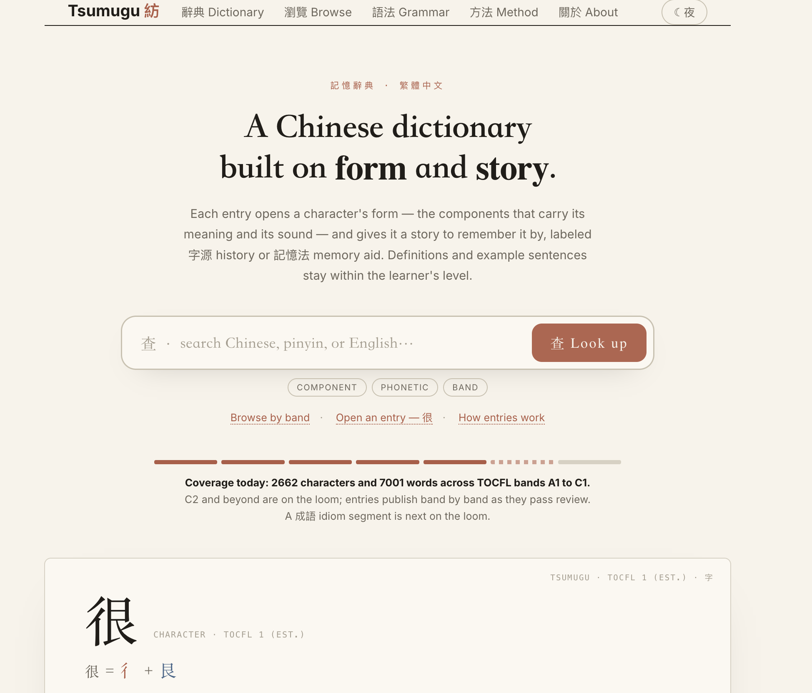

## What it is

The public encoding dictionary for Tsumugu. 9,663 character and word entries plus 515 grammar patterns for students of Traditional Chinese. Entries open with form and functional structure, followed by stories, mnemonics, cross-referenced grammar, and in-language explanations and examples. The site is generated from the private tsumugu-ed content store (one JSON per entry) by `tsumugu-ed/scripts/render_site.py`.

## Status

Deployed to custom domain 2026-06-15. Validation passes (unique IDs across entries and patterns; schema clean). Grammar catalog reduced to 303 functional points after reconciliation; walls and duplicate English labels addressed in the prior copy pass. Home and About front-facing copy finalized. The dictionary is the compounding public asset of the Tsumugu production line; the reader, wiki, and engine remain separate surfaces.

## Links

- **Project status dashboard:** [view the live build-out tracker](/projects/tsumugu-ed-status.html) — done / in-progress / not-started across every content lane (snapshot 2026-06-21).
- **Live site:** https://tsumugu-ed.com
- **Main Tsumugu project (reader, wiki, engine):** [[projects/tsumugu]]
- **Dictionary custody decision:** [[journal/2026-06-11-tsumugu-dictionary-custody-and-display]]
- **Grammar browse and site copy pass:** [[journal/2026-06-15-tsumugu-grammar-browse-and-site-copy]]
