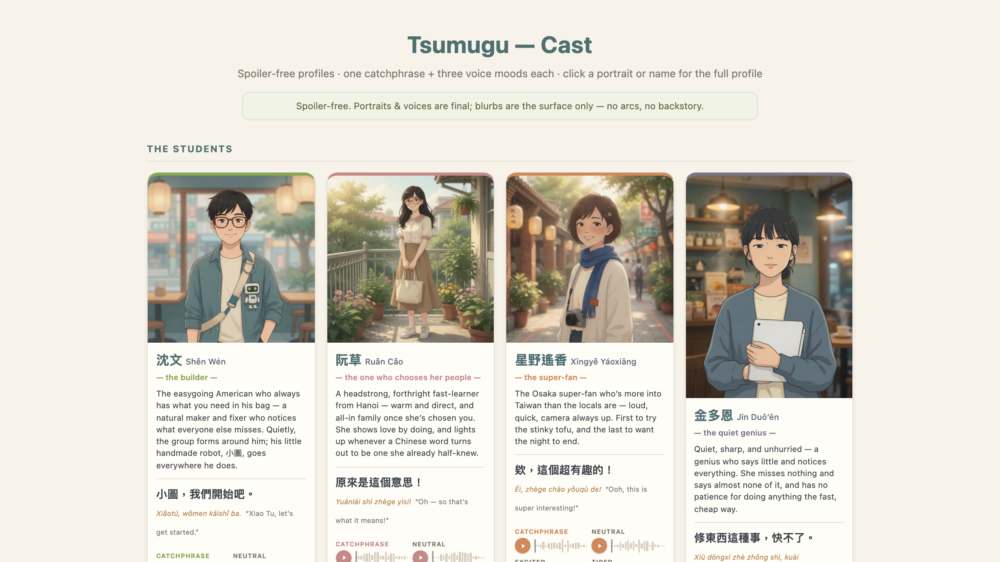

## What it is

Tsumugu is a comprehensible-input generator combined with a graded reader, and it is connected to a persistent record of the vocabulary you've learned. It starts from the premise of Karpathy's LLM-wiki and extends it into a reader that generates its own pages automatically. The reader has hover-over definitions, custom encoding pages, and definitions and summaries written in the text's own language. Each text is generated so that 80–95% of its words are words you already know, which is the comprehensible-input range. Because of this, the wiki changes to match your level as your vocabulary grows. The wiki is designed to grow vertically, meaning deeper text, as you add vocabulary. It is designed to grow horizontally, meaning more pages, according to your consumption habits, for example TV shows and YouTube videos.

The engine is a public base layer released under Apache-2.0. Each language is a pack added on top of the engine. The first two language packs are **Traditional Mandarin (Taiwan)** and **Vietnamese**. The Vietnamese pack has a **Hán-Việt bridge**, which uses Chinese as the starting point for learning the large Sino-Vietnamese vocabulary in Vietnamese.

## How it's built

Tsumugu is fully **client-side and offline**. The reader runs in the browser at no cost. All LLM work happens in **batch**. Coding agents (Claude Code / Grok Build) do that work by running scripts, and there is **no paid API in the core loop**. The app only uses the files the agents produce. One core engine contains the reader, a cross-language word store, knowledge-level colouring, and comprehensible-input scoring. A language pack sets the engine's parameters: dictionary, segmenter, phonetics, and leveling. The engine has a built-in pull SRS with no scheduler, plus Anki export. An OpenCC check runs on all Traditional-Chinese output. The project is split into a public engine repo, a public Quartz LLM-wiki, and a private layer for dictionaries and personal vocabulary.

## Status

Phases 0–7 are built: engine, offline reader, batch-generation CLI, and wiki / bridge / cross-reference. An audit found that the build meets eight of twelve PRD criteria. The remaining criteria are open-core by design. The wiki is live at <https://logos52.github.io/tsumugu-wiki/>. Tsumugu was built with Grok Build + Claude Code. The full record is in [[journal/2026-06-04-tsumugu|the build log]].

As of 2026-06-06, Phase 8 (voice) is in progress. Each sentence gets a voice note generated **locally, in batch, with open-source TTS** (Qwen3-TTS via mlx-audio: Apache-2.0, $0, offline after generation). The voice notes are for listening, reading, and shadowing. This replaces the earlier plan to use a subscription UI. The TTS engine was chosen in a listening comparison of engines. The record of that choice is [[journal/2026-06-06-tsumugu-voice|the voice log]].

## Links

- **The map of content, with the whole project on one page:** [[wiki/Tsumugu/Tsumugu|Tsumugu]]
- **The cast, with portraits and voice lines:** [/tsumugu/cast-profiles.html](/tsumugu/cast-profiles.html) (each card opens the character's own page) · the characters' moral cores: [[wiki/Story Craft/The Moral Core|The Moral Core]]
- **Live site, with the reader, the wiki, and the source:** <https://logos52.github.io/tsumugu/>
- **Open the reader directly:** <https://logos52.github.io/tsumugu/app/>
- **The wiki, with the graded-reader content:** <https://logos52.github.io/tsumugu-wiki/>
- **The engine, public, Apache-2.0:** <https://github.com/Logos52/tsumugu>
- **Wiki source (Quartz):** <https://github.com/Logos52/tsumugu-wiki>
