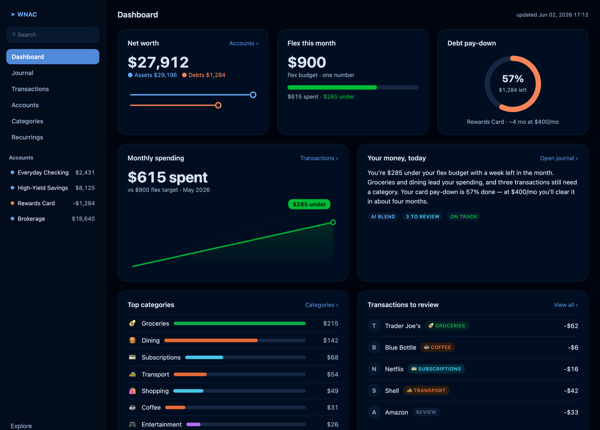

## What it is

WNAC ("Wedge Needs A Copilot") is a static, local-first personal-finance dashboard. It keeps the parts of [wnab](wnab) that were worth keeping — clean, deduplicated transaction data and explainable AI categorization — and drops the envelope budgeting that made wnab a chore. The interface is a single screen built to *feel* like Copilot Money: one **flex number** for how much is actually free to spend, and a **pay-down dial** for debt.

## How it's built

Three plain files, no server, no cloud account: an `import.py` that normalizes and dedupes bank exports, an `analyze.py` whose "brain" is swappable (deterministic rules or an LLM), and a static `dashboard.html`. Everything runs on the local machine.

The privacy stance is built into the architecture: **the method is public, the money is private.** The code and design ship openly; the data, balances, and accounts never enter the repo and never leave the machine. That is why the screenshot above uses demo data, never real balances.

## What worked

Dropping envelopes was the unlock. A single flex number answers the only question I ask daily — "can I spend this?" — without the assign-every-dollar ritual. The swappable AI brain means the dashboard degrades gracefully to plain rules when I don't want a model in the loop, and the local-first design sidesteps the cold-start, subscription, and trust problems of cloud finance apps.

## Lessons so far

- **Keep the value, cut the ceremony.** wnab proved the data pipeline and AI insight were worth having; WNAC keeps those and removes the part that never earned its upkeep.
- **Privacy is an architecture decision.** "Method public, money private" holds because the data never touches the repo or a server — the design enforces it, so the project can live in the open without leaking a number.

## Status

Current. Active build, succeeding [wnab](wnab).

<!-- Design notes (TODO, Wedge): how it looks and why it's built this way. -->

