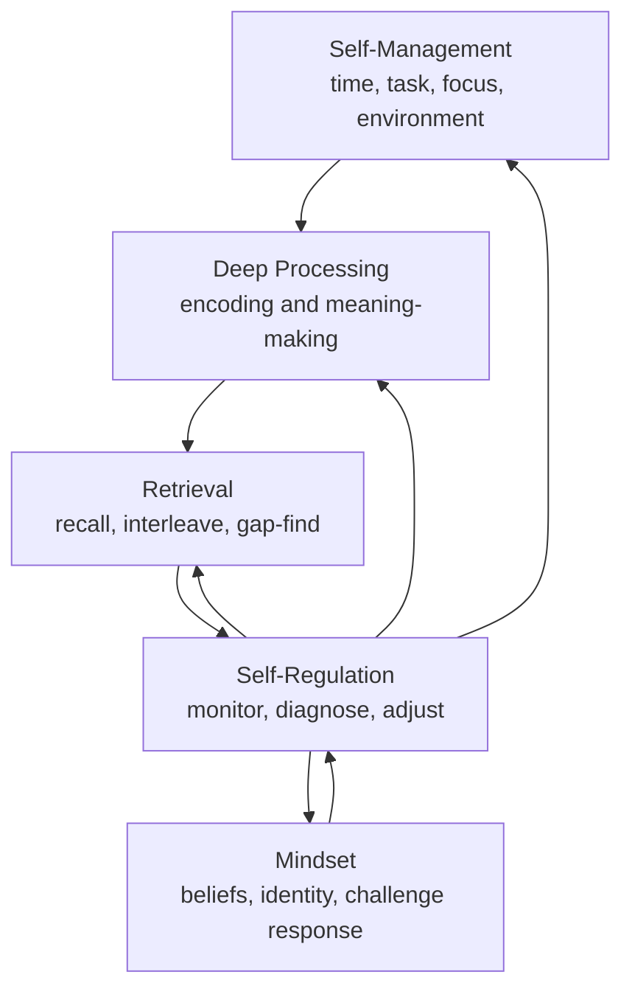

# Dimensions of Learning

The study system becomes easier to diagnose when learning is separated into five dimensions.

## Summary

The system treats learning as more than a set of study techniques. Effective learning depends on five interacting dimensions:

- [[wiki/Dimensions/Deep Processing|Deep Processing]]
- [[wiki/Dimensions/Self-Management|Self-Management]]
- [[wiki/Dimensions/Self-Regulation|Self-Regulation]]
- [[wiki/Dimensions/Mindset|Mindset]]
- [[wiki/Dimensions/Retrieval|Retrieval]]

Each dimension answers a different question:

| Dimension | Core Question |
| --- | --- |
| [[wiki/Dimensions/Deep Processing|Deep Processing]] | Am I transforming information into meaningful structure? |
| [[wiki/Dimensions/Self-Management|Self-Management]] | Have I created the time, energy, attention, and environment to do the work? |
| [[wiki/Dimensions/Self-Regulation|Self-Regulation]] | Can I monitor what is happening and adjust my method? |
| [[wiki/Dimensions/Mindset|Mindset]] | Do my beliefs and identity support growth through difficulty? |
| [[wiki/Dimensions/Retrieval|Retrieval]] | Can I reconstruct and use the knowledge when needed? |

## Operating Model

Deep Processing and Retrieval are the main learning engines.

Self-Management makes the system executable. Mindset makes the system emotionally sustainable. Self-Regulation coordinates the whole system by noticing what is happening and selecting the right adjustment.

## Where Current Techniques Fit

| Technique | Primary Dimension | Secondary Dimension |
| --- | --- | --- |
| [[wiki/Techniques/Bear Hunter System|Bear Hunter System]] | [[wiki/Dimensions/Deep Processing|Deep Processing]] | [[wiki/Dimensions/Self-Regulation|Self-Regulation]] |
| [[wiki/Techniques/Aim|Aim]] | [[wiki/Dimensions/Deep Processing|Deep Processing]] | [[wiki/Dimensions/Self-Regulation|Self-Regulation]] |
| [[wiki/Techniques/Shoot|Shoot]] | [[wiki/Dimensions/Deep Processing|Deep Processing]] | [[wiki/Dimensions/Self-Regulation|Self-Regulation]] |
| [[wiki/Techniques/Skin|Skin]] | [[wiki/Dimensions/Deep Processing|Deep Processing]] | [[wiki/Dimensions/Self-Regulation|Self-Regulation]] |
| [[wiki/Techniques/Spaced Interleaved Retrieval|Spaced Interleaved Retrieval]] | [[wiki/Dimensions/Retrieval|Retrieval]] | [[wiki/Dimensions/Self-Regulation|Self-Regulation]] |
| [[wiki/Techniques/WPW|WPW]] | [[wiki/Dimensions/Retrieval|Retrieval]] | [[wiki/Dimensions/Self-Regulation|Self-Regulation]] |
| [[wiki/Techniques/Kolbs Experiential Cycle|Kolbs Experiential Cycle]] | [[wiki/Dimensions/Self-Regulation|Self-Regulation]] | [[wiki/Dimensions/Mindset|Mindset]] |
| [[wiki/Techniques/Marginal Gains|Marginal Gains]] | [[wiki/Dimensions/Self-Regulation|Self-Regulation]] | [[wiki/Dimensions/Mindset|Mindset]] |
| [[wiki/Techniques/Dimension Practice Tracks|Dimension Practice Tracks]] | all dimensions | [[wiki/Dimensions/Self-Regulation|Self-Regulation]] |
| [[wiki/Techniques/Upgrading Your Dimensions|Upgrading Your Dimensions]] | all dimensions | [[wiki/Dimensions/Self-Regulation|Self-Regulation]] |
| [[wiki/Concepts/Importance-Based Chunking|Importance-Based Chunking]] | [[wiki/Dimensions/Deep Processing|Deep Processing]] | [[wiki/Dimensions/Self-Regulation|Self-Regulation]] |
| [[wiki/Concepts/Knowledge Mastery - From Recognition to Usable Knowledge|Knowledge Mastery: From Recognition to Usable Knowledge]] | [[wiki/Dimensions/Self-Regulation|Self-Regulation]] | [[wiki/Dimensions/Retrieval|Retrieval]] |

## Diagnostic Pattern

When a learning problem appears, classify it by dimension before changing tactics.

| Symptom | Likely Dimension |
| --- | --- |
| I understand pieces but cannot see the big picture. | [[wiki/Dimensions/Deep Processing|Deep Processing]] |
| I know what to do but do not create the conditions to do it. | [[wiki/Dimensions/Self-Management|Self-Management]] |
| I use techniques but cannot tell if they are working. | [[wiki/Dimensions/Self-Regulation|Self-Regulation]] |
| I avoid difficulty or interpret struggle as personal failure. | [[wiki/Dimensions/Mindset|Mindset]] |
| I recognize notes but cannot reconstruct or apply them. | [[wiki/Dimensions/Retrieval|Retrieval]] |

## Related Pages

- [[wiki/Syntheses/Prestudy, BHS, and SIR - Turning Information into Usable Structure|Prestudy, BHS, and SIR: Turning Information into Usable Structure]]
- [[wiki/Concepts/Metacognition - The Control Layer|Metacognition: The Control Layer]]
- [[wiki/Concepts/Knowledge Mastery - From Recognition to Usable Knowledge|Knowledge Mastery: From Recognition to Usable Knowledge]]
- [[wiki/Concepts/Cognitive Load & What Mental Effort Is Trying to Cue|Cognitive Load & What Mental Effort Is Trying to Cue]]
- [[wiki/Concepts/Are You Thinking, or Just Consuming|Are You Thinking, or Just Consuming?]]
- [[wiki/Techniques/Upgrading Your Dimensions|Upgrading Your Dimensions]]
- [[wiki/Techniques/Dimension Practice Tracks|Dimension Practice Tracks]]
- [[wiki/Techniques/Kolbs Experiential Cycle|Kolbs Experiential Cycle]]
- [[wiki/Techniques/Marginal Gains|Marginal Gains]]

## Open Questions

- What diagnostic checklist should route study problems to the right dimension?
- Which dimension is currently the user's main bottleneck?
- Should each daily/weekly review include a Dimensions of Learning score?
